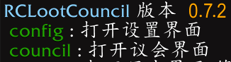
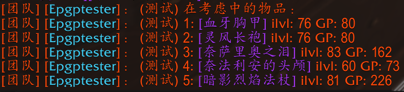
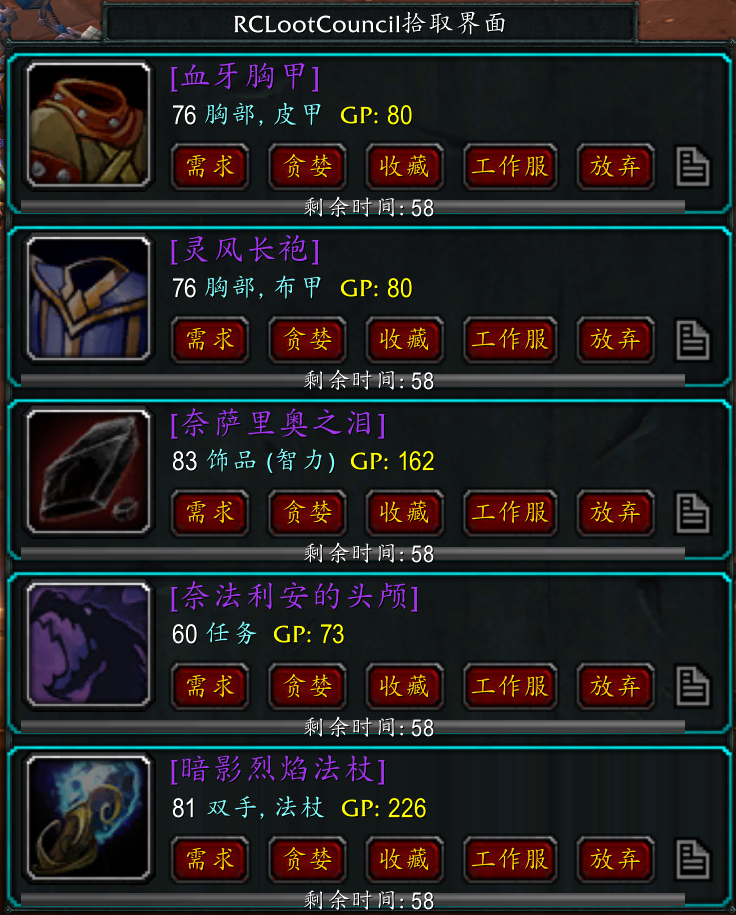

# RCLootCouncil

为提升分配效率，⑧团使用 `RCLootCouncil Classic` 分配插件，**请及时下载安装，否则无法参与分配**。

## 安装方式

1. [桃乐豆](http://www.taoledou.com/) 搜索 `RCLootCouncil Classic`
2. 在 [CurseForge](https://www.curseforge.com/wow/addons/rclootcouncil-classic/files) 下载最新版
3. 在群内下载最新安装包（下载后推荐使用桃乐豆保持更新）

注意：`RCLootCouncil Classic`，不是 RCLootCouncil Classic - EPGP。

## 安装验证

在游戏聊天窗口输入 `/rc`，看到插件版本信息和帮助才算安装成功。

## 分配方式

1. BOSS 倒地、复活队友后**立即**开始分配，分配者会在团队中通告物品及相应 GP。

   

2. 开始分配后你会看到自动弹出的投票窗口，根据情况选择：
   - **需求**：全分，第一优先级。
   - **贪婪**：5 GP，第二优先级，非 BIS 的替代装备、副天赋等在 raid 中会使用的装备，比如狂暴战拿狗链、奶牧拿暗伤装。
   - **收藏**：1 GP，第三优先级，收藏、PVP、带副本等，不在 raid 中使用，比如战士拿火锅头、法师拿黑灰长袍。
   - **工作服**：0 GP，团队特殊需要，比如狂暴战拿套装、奶德拿熊装。优先级和拾取权由公会决定。
   - **备注**：放弃按钮右边，需要向分配者说明的情况。

   分配者可以看到你同部位的装备以决定是否可以副天赋拿，如果装备在包里务必添加备注。

   

3. 倒计时结束后按投票情况进行分配和扣分。暂定倒计时 60 秒，之后酌情调整。

## 议会

议会成员可以看到所有人的投票结果，名单由分配者设置。想加入或退出议会请联系分配者。
