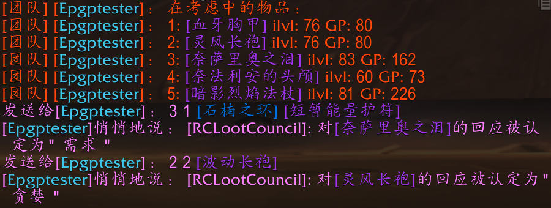

# RCLootCouncil

为提升分配效率，⑧团使用 `RCLootCouncil Classic` 分配插件，**请及时下载安装，否则可能无法参与分配**。

## 安装方式

- [桃乐豆](http://www.taoledou.com/) 搜索 `RCLootCouncil Classic`
- 在 [CurseForge](https://www.curseforge.com/wow/addons/rclootcouncil-classic/files) 下载最新版
- 在群内下载最新安装包（下载后推荐使用桃乐豆保持更新）

注意：
- `RCLootCouncil Classic`，不是 RCLootCouncil Classic - EPGP。
- 安装后无需进行任何设置。

## 安装验证

在游戏聊天窗口输入 `/rc`，看到插件版本信息和帮助才算安装成功。

## 分配方式

### 分配者通告

BOSS 倒地、复活队友后**立即**开始分配，分配者会在团队中通告物品及相应 GP。

### 个人投票

开始分配后你会看到自动弹出的投票窗口，根据情况选择：
- **需求**：全分，第一优先级。
- **贪婪**：5 GP，第二优先级，非 BIS 的替代装备、副天赋等在 raid 中会使用的装备，比如狂暴战拿狗链、奶牧拿暗伤装。
- **收藏**：1 GP，第三优先级，收藏、PVP、带副本等，不在 raid 中使用，比如战士拿火锅头、法师拿黑灰长袍。
- **工作服**：0 GP，团队特殊需要，比如狂暴战拿套装、奶德拿熊装。优先级和拾取权由公会决定。
- **备注**：放弃按钮右边，需要向分配者说明的情况。

分配者可以看到你同部位的装备以决定是否可以副天赋拿，如果装备在包里务必添加备注。

### 倒计时

倒计时结束后按投票情况进行分配和扣分。暂定倒计时 60 秒，之后酌情调整。

### 未安装插件

因合理意外情况未安装插件，可以密语分配者来投票，密语格式：

`物品编号 需求类型 当前物品1 当前物品2`

- **物品编号**：分配者通告中，物品链接前面的数字序号。
- **需求类型**：数字 1234，1（需求）、2（贪婪）、3（收藏）、4（工作服）。
- **当前物品**：已有物品的链接，让分配者决定你是否可以贪婪以及补分。主副手、戒指、饰品需要发送两件，中间有空格。

密语投票成功会收到密语提示，否则为失败。请在清小怪时自行安装插件，密语格式错误或超时多次后不予分配装备。如果忘记可以密语分配者 `rchelp` 获取帮助。

## 议会

议会成员可以看到所有人的投票结果，名单由分配者设置。想加入或退出议会请联系分配者。
